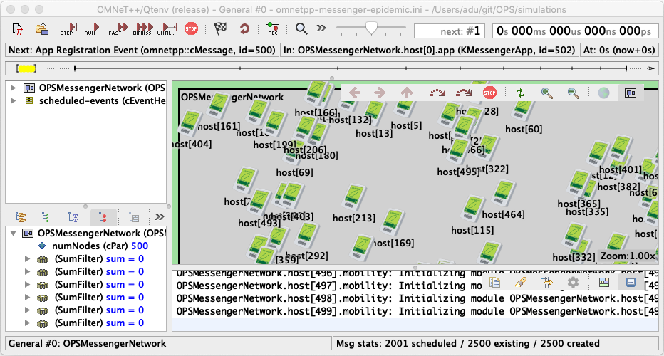
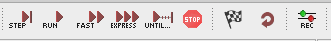
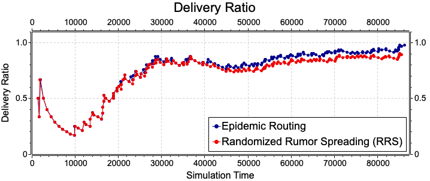

# OPS
The Opportunistic Protocol Simulator (OPS, pronounced as oops!!!) is a set of
simulation models for OMNeT++ to simulate opportunistic networks. It has a
modular architecture where different protocols relevant to opportunistic networks
can be developed and plugged in. The details of prerequisites, installing OPS, 
configuring OPS, simulating with OPS and much more are given in the following 
sections.

But here are the most important links to get OPS running quickly.

1. Install and build components required by OPS [Prerequisites](#prerequisites)

2. Install OPS - [Install and Build OPS](#install-and-build-ops)

3. Run simulations - [Running Simulations](#running-simulations)

## Prerequisites

The models of OPS require OMNeT++, the INET framework, the KeetchiLib and some mobility models
that are not part of the INEt framework. Each of the sections below describe how these are
installed and configured.

### OMNeT++ (Version 5.4.1)

OPS requires OMNeT++. Install OMNeT++ version 5.4.1 using the following resources.

- [OMNeT++ Installation Guide](https://omnetpp.org/documentation/)
- [OMNeT++ Installation Binaries](https://omnetpp.org/download/)

Once OMNeT++ is installed, run the OMNeT++ IDE. The IDE provides options to install all the 
additional components (OMNeT++ frameworks, libraries, etc.) required by OPS.

### INET Framework (Version 4.1.0)

OPS requires the use of [INET Framework](https://inet.omnetpp.org), version 4.1.0, of OMNeT++ to simulate
mobility. There are a number of ways of installing the INET Framework in the IDE. OPS require the exact 
version 4.1.0. So, do not install the default version prompted by the IDE when run for the first time.

There are many ways of installing INET 4.1.0. We recommend the following way.

1. Run the OMNeT++ IDE

2. Select `File->Import->Git->Projects from Git->Clone URI->` and provide the following parameters and 
install INET
  - URI `https://github.com/inet-framework/inet.git`
  - Branch `v4.1.x`
  - Wizard for project import `Import existing Eclipse projects`

3. Select the installed project in `Project Explorer` pane and set the active configuration to `release` using
`Project->Properties->C/C++ Build->Manage Configurations...`

4. Select the installed project in `Project Explorer` pane and build INET using `Project->Build Project`

**Note:** The build project should result in an error free build.

### KeetchiLib

An external library called `KeetchiLib` is used by the `KKeetchiLayer` model to handle all the functionality
related to the [Organic Data Dissemination](https://www.mdpi.com/1999-5903/11/2/29/htm)
forwarding model. The code for this library is available at Github. 

There are many ways of installing KeetchiLib. We recommend the following way.

1. Run the OMNeT++ IDE

2. Select `File->Import->Git->Projects from Git->Clone URI->` and provide the following parameters 
and install KeetchiLib
  - URI `https://github.com/ComNets-Bremen/KeetchiLib.git`
  - Branch `master`
  - Wizard for project import `Import existing Eclipse projects`

3. Select the installed project in `Project Explorer` pane and set the active configuration to `release` using
`Project->Properties->C/C++ Build->Manage Configurations...`

4. Select the installed project in `Project Explorer` pane and build KeetchiLib using `Project->Build Project`

**Note:** The build project should result in an error free build.

###  SWIM Mobility Model

[Small Worlds in Motion](https://arxiv.org/pdf/0809.2730.pdf) (SWIM) is a mobility model
developed by A. Mei and J. Stefa. The INET code for the SWIM mobility model was developed 
by our research group. SWIM is used by many of the OPS scenarios for mobility. 

There are many ways of installing SWIM. We recommend the following way.

1. Run the OMNeT++ IDE

2. Select `File->Import->Git->Projects from Git->Clone URI->` and provide the following parameters 
and install SWIMMobility
  - URI `https://github.com/ComNets-Bremen/SWIMMobility.git`
  - Branch `master`
  - Wizard for project import `Import as general project`

3. Copy the following 3 files into the INET project folder `src/inet/mobility/single`
  - `SWIMMobility.ned`
  - `SWIMMobility.h`
  - `SWIMMobility.cc`

4. Select the INET project in `Project Explorer` pane and rebuild INET using `Project->Build Project`

## Install and Build OPS

Once the prerequisites are installed and built, to install and build OPS, follow the procedure below.

1. Run the OMNeT++ IDE

2. Select `File->Import->Git->Projects from Git->Clone URI->` and provide the following parameters 
and install OPS
  - URI `https://github.com/ComNets-Bremen/OPS.git`
  - Branch `master`
  - Wizard for project import `Import existing Eclipse projects`

3. Copy the following 2 files, located in `res/inet-models/ExtendedSWIMMobility` into the INET 
project folder `src/inet/mobility/contract`
  - `IReactiveMobility.ned`
  - `IReactiveMobility.h`

4. Copy the following 2 files, located in `res/inet-models/ExtendedSWIMMobility` into the INET 
project folder `src/inet/mobility/single`
  - `ExtendedSWIMMobility.ned`
  - `ExtendedSWIMMobility.h`

5. Select the installed project in `Project Explorer` pane and set the active configuration to `release` using
`Project->Properties->C/C++ Build->Manage Configurations...`

6. Select the INET project in `Project Explorer` pane and rebuild INET using `Project->Build Project`

7. Select the OPS project in `Project Explorer` pane and select `File->Properties->Project References`

8. Tick the installed INET and KeetchiLib, and click `Apply and Close`.

9. Select the OPS project again in `Project Explorer` pane and build using `Project->Build Project`

**Note:** The build project should result in an error free build.

## Running Simulations

To run simulations, an OMNeT++ `.ini` file has to be used. A number of sample `.ini` files are given
with different scenarios. To run simulations, follow the procedure given below.

1. Run the OMNeT++ IDE

2. Select a sample `.ini` file from the folder `simulations/` (e.g., `omnetpp-messenger-epidemic.ini`)

3. Select `Run->Run As->OMNeT++ Simulation`. The following window should appear.

  

4. Start simulating the network by clicking on the simulation controls:

## Creating Statistics Graphs

Based on the standard configuration, the raw results (vector and scalar) collected after a simulation run 
are located in the `simulation/results` folder. Below is a brief (high-level) procedure to create your charts
using the OMNeT++ IDE. 

1. Run the OMNeT++ IDE

2. In the `simulation/results` folder, create an `Analysis File` by selecting `New -> Analysis File (anf)`

3. Add the created results files (`*.vec` or `*.sca`) to the created file

4. Create datasets with the data you want plotted in every graph

5. Plot them using an appropriate chart type (Line, Bar, etc.)

For more information, check Chapter 10 of the [IDE User Guide](https://www.omnetpp.org/doc/omnetpp/UserGuide.pdf)

An example results chart generated using 2 simulations (Epidemic and RRS) is shown below.

  

## Available Statistics

There are a set of network-level as well as node-level statistics collected by OPS in every 
simulation run. Check the [STATS file](./STATS.md) to know about all the available statistics.

## Creating New Scenarios

To run simulations for different scenarios, duplicate an existing `.ini` file and modify the model
parameters as required. To know about all the model parameters, check the `.ned` files in the 
`src/` folder.

## Node and Network Architectures

There are **two node models** used in OPS, configured with different protocol layers to simulate 
opportunistic  networks. To use the two distinct behavioural properties of these two node models, 
**two network models** are used, each using one of the node models. A description of these models 
and the important model parameters is given below.

### User Behaviour based Network Model (OPSUBMNetwork)

The `OPSUBMNetwork` is a network model to simulate networks that use `KUBMNode` type nodes
in opportunistic networks. These nodes are configured with an application layer that uses
the user behaviour model identified in 
[Reactive User Behavior and Mobility Models](https://arxiv.org/abs/1709.06395). To cater 
to the data traffic generation model used in these nodes, a `KBasicNotificationGenerator` 
is configured at the network level. The picture below shows the `OPSUBMNetwork` model.

  

Details of the `KUBMNode` node model follows.

### Messenger based Network Model (OPSMessengerNetwork)

The `OPSMessengerNetwork` is a network model to simulate a network deployed with `KMessengerNode`
type node models. The node models contain application that generate destination oriented data.
The picture below shows the `OPSMessengerNetwork` model. 

  

Details of the `KMessengerNode` node model follows.

### User Behaviour based Node Model (KUBMNode)

The `KUBMNode` consist of protocol layers to simulate opportunistic networks where the data in the
network are based on user behaviour modelling (see [Reactive User Behavior and Mobility Models](https://arxiv.org/abs/1709.06395)). The node architecture is as shown 
in the picture below.

  

The `KUBMNode` requires a Notification Generator which is a network-wide model that holds a set 
of messages and disseminates to the user behaviour models of nodes. The models associated with 
notification generation are,

   - `KBasicNotificationGenerator` - Notifications (i.e., messages) are held and disseminated to the user behaviour 
models of each node to inject them into the network.

The layers of a node can be configured to use different implementations relevant to the specific layer as 
listed below.

1. Application Layer with UBM - Applications generate data and feedback based on the preferences
   of the users. The details of the application and the user behaviour model (UBM) are described in 
   the publication [Reactive User Behaviour and Mobility Models](https://arxiv.org/pdf/1709.06395.pdf). 
   Current models are,

   - `KBasicUBM` - Performs the enforcement of user preferences on the notifications (messages)
   - `KBasicUBMApp` - Injects and receives to/from network

2. Opportunistic Networking Layer - Performs the forwarding of data and feedback according
   to the forwarding strategy employed. Current implementations are,

   - `KRRSLayer` - Implements a simple forwarding strategy based on the Randomised
     Rumor Spreading (RRS) algorithm which randomly selects a data item to broadcast
     to a node's neighbourhood
   - `KKeetchiLayer` - Implements the Organic Data Dissemination algorithm as described
     in the publication [A Novel Data Dissemination Model for Organic Data Flows](https://link.springer.com/chapter/10.1007%2F978-3-319-26925-2_18) by
     A. Foerster et al
   - `KEpidemicRoutingLayer` - Implements the epidemic routing algorithm as described
     in the publication [Epidemic Routing for Partially-Connected Ad Hoc Networks](http://issg.cs.duke.edu/epidemic/epidemic.pdf)
     by A. Vahdat and D. Becker

3. Link Adaptation Layer - Tasked with converting packets sent by the Opportunistic
   Networking Layer to the specific link technology used (at Link Layer). Currently
   implemented has a simple pass-through layer.

   - `KLinkAdaptLayer` - Pass-through layer

4. Link Layer - Implements the operations of a link technology used. Currently has
   the following implementation.

   - `KWirelessInterface` - A simple wireless interface implementation (without the `INET
     framework`)

5. Mobility - Implements the mobility modelling for the node. Currently uses the interfaces
   provided by the `INET framework` and therefore, is able to use any of the mobility models
   supported by the `INET framework`.

### Messenger Node Model (KMessengerNode)
The `KMessengerNode` consist of protocol layers to simulate destination oriented opportunistic 
networks where every data item in the network is destined to another node. The node 
architecture is as shown in the picture below.

  

The layers of a node can be configured to use different implementations relevant to the specific layer as 
listed below.

1. Application Layer with simple applications - Applications generate data destined to other nodes
or receive data destined to itself. Current models are,

   - `KMessengerApp` - Injects and receives destination oriented data

2. Opportunistic Networking Layer - Performs the forwarding of data and feedback according
   to the forwarding strategy employed. Current implementations are,

   - `KRRSLayer` - Implements a simple forwarding strategy based on the Randomised
     Rumor Spreading (RRS) algorithm which randomly selects a data item to broadcast
     to a node's neighbourhood
   - `KKeetchiLayer` - Implements the Organic Data Dissemination algorithm as described
     in the publication [A Novel Data Dissemination Model for Organic Data Flows](https://link.springer.com/chapter/10.1007%2F978-3-319-26925-2_18) by
     A. Foerster et al
   - `KEpidemicRoutingLayer` - Implements the epidemic routing algorithm as described
     in the publication [Epidemic Routing for Partially-Connected Ad Hoc Networks](http://issg.cs.duke.edu/epidemic/epidemic.pdf)
     by A. Vahdat and D. Becker

3. Link Adaptation Layer - Tasked with converting packets sent by the Opportunistic
   Networking Layer to the specific link technology used (at Link Layer). Currently
   implemented has a simple pass-through layer.

   - `KLinkAdaptLayer` - Pass-through layer

4. Link Layer - Implements the operations of a link technology used. Currently has
   the following implementation.

   - `KWirelessInterface` - A simple wireless interface implementation (without the `INET
     framework`)

5. Mobility - Implements the mobility modelling for the node. Currently uses the interfaces
   provided by the `INET framework` and therefore, is able to use any of the mobility models
   supported by the `INET framework`.

## Important Model Parameters

The following list provides some of the most important parameters of the different models 
in OPS. All these parameters are configurable using the `.ini`. **Not all parameters 
are listed here**. Please check the respective model's `.ned` file to see all the parameters.

### Parameters in `OPSMessengerNetwork.ned` and `OPSUBMNetwork`

1. `numNodes` - The total number of nodes in the network
2. Network level statistics

### Parameters in `KEpidemicRoutingLayer.ned`

1. `maximumCacheSize` - The size of the cache maintained by each node in bytes
2. `maximumHopCount` - The maximum hops that a data packet is allowed to travel (be forwarded) before being discarded

### Parameters in `KWirelessLayer.ned`

1. `wirelessRange` - The wireless range of each node's wireless interface
2. `bandwidthBitRate` - Communication bit rate of the wireless interface

## Help

If you have any question or clarifications related to OMNeT++, please check the documentation provided at the [OMNeT++ site](https://www.omnetpp.org) and
[INET](https://inet.omnetpp.org) sites. Here are the important documents.

1. OMNeT++ - [Install Guide](https://www.omnetpp.org/doc/omnetpp/InstallGuide.pdf), 
   [Simulation Manual](https://www.omnetpp.org/doc/omnetpp/SimulationManual.pdf), 
   [IDE User Guide](https://www.omnetpp.org/doc/omnetpp/UserGuide.pdf)

2. INET - [Documentation](https://inet.omnetpp.org/Introduction.html)

3. Results processing in OMNeT++ IDE - Chapter 10 of the [IDE User Guide](https://www.omnetpp.org/doc/omnetpp/UserGuide.pdf)

4. INET Mobility Models - [Node Mobility](https://inet.omnetpp.org/docs/users-guide/ch-mobility.html)

## Frequently Asked Questions and Known Problems

We have compiled a list of frequently asked questions and solutions to some known 
problems. Check the [FAQ file](./FAQ.md) for these questions and answers.

## Questions or Comments

Firstly, if you have any questions, please check the [FAQ file](./FAQ.md) and if you cannot find answers there, then
write to us. Secondly, if you have any comments or suggestions, we will be very glad to hear them. In both cases, please
write to us using any of the e-mail adresses below.

  - Asanga Udugama (adu@comnets.uni-bremen.de)
  - Jens Dede (jd@comnets.uni-bremen.de)
  - Anna Förster (anna.foerster@comnets.uni-bremen.de)
  - Vishnupriya Parimalam (vp@fb1.uni-bremen.de)

## Model Contributors

There are many individuals who have used and extended OPS, either by extending existing models or by introducing new 
models. This section lists the individuals who have done such contributions.

  - Anas bin Muslim
  - Jibin P. John
  - Karima Khandaker 
  - Kirishanth Chethuraja

