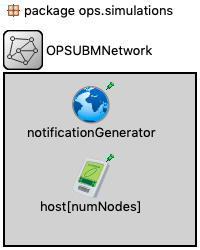
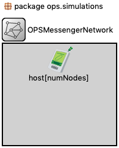
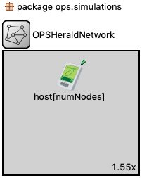
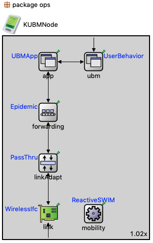
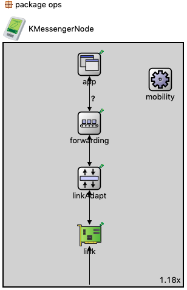
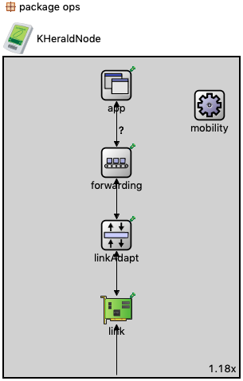

# Node and Network Architectures

There are **three node models** used in OPS, configured with different protocol layers to simulate 
opportunistic  networks. To use the three distinct behavioural properties of these three node models, 
**three network models** are used, each using one of the node models. A description of these models 
is given below.

## User Behaviour based Network Model (OPSUBMNetwork)

The `OPSUBMNetwork` is a network model to simulate networks that use `KUBMNode` type nodes
in opportunistic networks. These nodes are configured with an application layer that uses
the user behaviour model identified in 
[Reactive User Behavior and Mobility Models](https://arxiv.org/abs/1709.06395). To cater 
to the data traffic generation model used in these nodes, a `KBasicNotificationGenerator` 
is configured at the network level. The picture below shows the `OPSUBMNetwork` model.

  

Details of the `KUBMNode` node model are given [below](#user-behaviour-based-node-model-(kubmnode)).

## Messenger based Network Model (OPSMessengerNetwork)

The `OPSMessengerNetwork` is a network model to simulate a network deployed with `KMessengerNode`
type node models. The node models contain application that generate destination oriented data.
The picture below shows the `OPSMessengerNetwork` model. 

  

Details of the `KMessengerNode` node model are given [below](#messenger-node-model-(kmessengernode)).

## Herald based Network Model (OPSHeraldNetwork)

The `OPSHeraldNetwork` is a network model to simulate a network deployed with `KHeraldNode`
type node models. The node models contain application that generate destination-less data. This
model is similar to its operation with the OPSUBMNetwork but much simplified and therefore, less
flexible. The picture below shows the `OPSHeraldNetwork` model. 

  

Details of the `KMessengerNode` node model are given [below](#messenger-node-model-(kmessengernode)).

## User Behaviour based Node Model (KUBMNode)

The `KUBMNode` consist of protocol layers to simulate opportunistic networks where the data in the
network are based on user behaviour modelling (see [Reactive User Behavior and Mobility Models](https://arxiv.org/abs/1709.06395)). The node architecture is as shown 
in the picture below.

  

The `KUBMNode` requires a Notification Generator which is a network-wide model that holds a set 
of messages and disseminates to the user behaviour models of nodes. The models associated with 
notification generation are,

   - `KBasicNotificationGenerator` - Notifications (i.e., messages) are held and disseminated to the user behaviour 
models of each node to inject them into the network.

The layers of a node can be configured to use different implementations relevant to the specific layer as 
listed below.

1. Application Layer with UBM - Applications generate data and feedback based on the preferences
   of the users. The details of the application and the user behaviour model (UBM) are described in 
   the publication [Reactive User Behaviour and Mobility Models](https://arxiv.org/pdf/1709.06395.pdf). 
   Current models are,

   - `KBasicUBM` - Performs the enforcement of user preferences on the notifications (messages)
   - `KBasicUBMApp` - Injects and receives to/from network

2. Opportunistic Networking Layer - Performs the forwarding of data and feedback according
   to the forwarding strategy employed. Current implementations are,

   - `KRRSLayer` - Implements a simple forwarding strategy based on the Randomised
     Rumor Spreading (RRS) algorithm which randomly selects a data item to broadcast
     to a node's neighbourhood
   - `KKeetchiLayer` - Implements the Organic Data Dissemination algorithm as described
     in the publication [A Novel Data Dissemination Model for Organic Data Flows](https://link.springer.com/chapter/10.1007%2F978-3-319-26925-2_18) by
     A. Foerster et al
   - `KEpidemicRoutingLayer` - Implements the epidemic routing algorithm as described
     in the publication [Epidemic Routing for Partially-Connected Ad Hoc Networks](http://issg.cs.duke.edu/epidemic/epidemic.pdf)
     by A. Vahdat and D. Becker
     
 
3. Link Adaptation Layer - Tasked with converting packets sent by the Opportunistic
   Networking Layer to the specific link technology used (at Link Layer). Currently
   implemented has a simple pass-through layer.

   - `KLinkAdaptLayer` - Pass-through layer

4. Link Layer - Implements the operations of a link technology used. Currently has
   the following implementation.

   - `KWirelessInterface` - A simple wireless interface implementation (without the `INET
     framework`)

5. Mobility - Implements the mobility modelling for the node. Currently uses the interfaces
   provided by the `INET framework` and therefore, is able to use any of the mobility models
   supported by the `INET framework`.

## Messenger Node Model (KMessengerNode)

The `KMessengerNode` consist of protocol layers to simulate destination oriented opportunistic 
networks where every data item in the network is destined to another node. The node 
architecture is as shown in the picture below.

  

The layers of a node can be configured to use different implementations relevant to the specific layer as 
listed below.

1. Application Layer with simple applications - Applications generate data destined to other nodes
or receive data destined to itself. Current models are,

   - `KMessengerApp` - Injects and receives destination oriented data

2. Opportunistic Networking Layer - Performs the forwarding of data and feedback according
   to the forwarding strategy employed. Current implementations are,

   - `KRRSLayer` - Implements a simple forwarding strategy based on the Randomised
     Rumor Spreading (RRS) algorithm which randomly selects a data item to broadcast
     to a node's neighbourhood
   - `KKeetchiLayer` - Implements the Organic Data Dissemination algorithm as described
     in the publication [A Novel Data Dissemination Model for Organic Data Flows](https://link.springer.com/chapter/10.1007%2F978-3-319-26925-2_18) by
     A. Foerster et al
   - `KEpidemicRoutingLayer` - Implements the epidemic routing algorithm as described
     in the publication [Epidemic Routing for Partially-Connected Ad Hoc Networks](http://issg.cs.duke.edu/epidemic/epidemic.pdf)
     by A. Vahdat and D. Becker
   - `KProphetRoutingLayer` - Implements the PROPHET protocol, a probabilistic routing 
     protocol for intermittently connected networks 
     as described in [Probabilistic Routing in Intermittently Connected Networks](http://citeseerx.ist.psu.edu/viewdoc/download?doi=10.1.1.59.6027&rep=rep1&type=pdf)
   - `KSpraywaitRoutingLayer` - Implements the Spray and Wait protocol, a protocol that “sprays” 
      a number of copies into the network, and then “waits” till one of these nodes meets the 
      destination as described in [Spray and Wait: An Efficient Routing Scheme for Intermittently Connected Mobile Networks](http://chants.cs.ucsb.edu/2005/papers/paper-SpyPso.pdf)
   - `KOptimumDelayRoutingLayer` - Implements a forwarding protocol that involves no 
      communication delays to compute optimum results for a given OppNets scenario

3. Link Adaptation Layer - Tasked with converting packets sent by the Opportunistic
   Networking Layer to the specific link technology used (at Link Layer). Currently
   implemented has a simple pass-through layer.

   - `KLinkAdaptLayer` - Pass-through layer

4. Link Layer - Implements the operations of a link technology used. Currently has
   the following implementation.

   - `KWirelessInterface` - A simple wireless interface implementation (without the `INET
     framework`)

5. Mobility - Implements the mobility modelling for the node. Currently uses the interfaces
   provided by the `INET framework` and therefore, is able to use any of the mobility models
   supported by the `INET framework`.

## Herald Node Model (KHeraldNode)

The `KHeraldNode` consist of protocol layers to simulate destination-less opportunistic 
networks where every data item in the network may be desired by multiple nodes. The node 
architecture is as shown in the picture below.

  

The layers of a node can be configured to use different implementations relevant to the specific layer as 
listed below.

1. Application Layer with simple applications - Applications inject data which are desired by multiple nodes
or receive data destined desired by itself. Current models are,

   - `KHeraldApp` - Injects and receives destination-less data

2. Opportunistic Networking Layer - Performs the forwarding of data and feedback according
   to the forwarding strategy employed. Current implementations are,

   - `KRRSLayer` - Implements a simple forwarding strategy based on the Randomised
     Rumor Spreading (RRS) algorithm which randomly selects a data item to broadcast
     to a node's neighbourhood
   - `KKeetchiLayer` - Implements the Organic Data Dissemination algorithm as described
     in the publication [A Novel Data Dissemination Model for Organic Data Flows](https://link.springer.com/chapter/10.1007%2F978-3-319-26925-2_18) by
     A. Foerster et al
   - `KEpidemicRoutingLayer` - Implements the epidemic routing algorithm as described
     in the publication [Epidemic Routing for Partially-Connected Ad Hoc Networks](http://issg.cs.duke.edu/epidemic/epidemic.pdf)
     by A. Vahdat and D. Becker
   - `KOptimumDelayRoutingLayer` - Implements a forwarding protocol that involves no 
      communication delays to compute optimum results for a given OppNets scenario 

3. Link Adaptation Layer - Tasked with converting packets sent by the Opportunistic
   Networking Layer to the specific link technology used (at Link Layer). Currently
   implemented has a simple pass-through layer.

   - `KLinkAdaptLayer` - Pass-through layer

4. Link Layer - Implements the operations of a link technology used. Currently has
   the following implementation.

   - `KWirelessInterface` - A simple wireless interface implementation (without the `INET
     framework`)

5. Mobility - Implements the mobility modelling for the node. Currently uses the interfaces
   provided by the `INET framework` and therefore, is able to use any of the mobility models
   supported by the `INET framework`.
   

