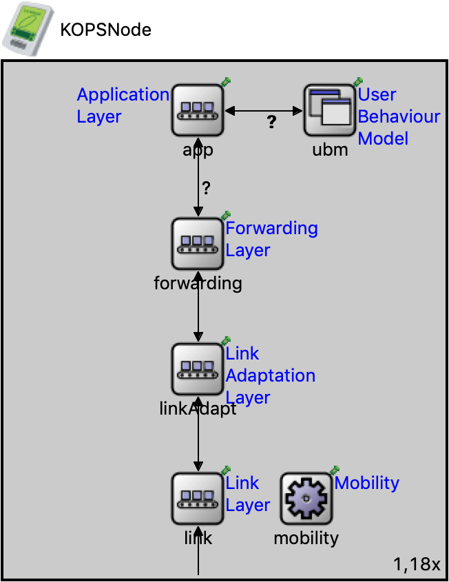

# Node and Network Architecture

The OPS node and network architecture consisit of a network model, a node model and a number of protocol 
layer models that can be combined to build nodes to simulate opportunistic networks. A description 
of these models is given below.

## OPS Network Model (OPSNetwork)

`OPSNetwork` is the network model where all the nodes of the network are defined. All nodes
must be of the type `KOPSNode` and optionally, a model conforming to `INotificationGenerator`.
A `KOPSNode` contains the protocol stack of an opportunistic networking node. The `INotificationGenerator`
is required when the network is configured to use the user behaviour model identified in 
[Reactive User Behavior and Mobility Models](https://arxiv.org/abs/1709.06395). But a simple
user behaviour does not require to use `INotificationGenerator`. Therefore, by default, no
user behaviour modelling is considered. The picture below shows the `OPSNetwork` model.

  

## OPS Node Model (OPSNetwork)

`KOPSNode` is the node model used to simulate opprtunisic networks. It is organised in
terms of layered protocol stack. Each layer is configured as an interface to plug in
different protocol layer implementations. The picture below shows the architecture of
the `KOPSModel` model.

  

When evaluating the performance of opportunistic networks, the following aspects must
be considered before configuring a node.

1. What **application model** (Applcation Layer) is used to generate and receive data?

2. What **forwarding model** (Forwarding Layer) is used to forward packets by nodes?

3. What **link adaptation model** (Link Adaptation Layer) is used if the nodes are overlaid on another transport protocol?

4. What **link layer model** (Link Layer) used to make direct communications between nodes?

5. What **mobility model** (Mobility) is used to simulated movements of users?

Configuring a node is done using the `.ini` file. A sample is given [here](../../simulations/omnetpp-ops.ini) 

### Application Layer

The application layer generates and injects data into the network. At the same time, it expects
data generated by other nodes. There are 3 types of application layers.

#### User Behaviour Based Application

This application layer is for nodes configured with the user behaviour model identified in 
[Reactive User Behavior and Mobility Models](https://arxiv.org/abs/1709.06395). To cater 
to the data traffic generation model used in these nodes, a `KBasicNotificationGenerator` 
is configured at the network level. This network-wide model holds a set of messages and 
disseminates to the user behaviour models of nodes. The user behaviour model is a 
destination-less data dissemination model. The models associated with notification 
generation are,

   - `KBasicNotificationGenerator` - Notifications (i.e., messages) are held and disseminated to 
     the user behaviour models of each node to inject them into the network.

The applicatin layer of every node is configured to use the user behaviour model by configuring 
the following models.

   - `KBasicUBM` - Performs the enforcement of user preferences on the notifications (messages)
   - `KBasicUBMApp` - Injects and receives to/from network

#### Destination Oriented Data Dissemination 

This is a simple application model allows the generation of data destined to other nodes. The 
data is generated (injected to the network) by each node in a round-robin manner. In the
single destination mode, all data are sent to one designated node. If this mode is not set, then
the data is sent to different destinations. The following model must be configured to use this
type of application.

   - `KMessengerApp` - Injects and receives destination oriented data

#### Destination-less Data Dissemination

This application model allows the injection of destinaion-less data into the network. This
means that these data items are expected by all the nodes in the network (not just one
destination). They are injected in a round-robin manner by nodes. The following model 
must be configured to use this type of application.

   - `KHeraldApp` - Injects and receives destination-less data

### Forwarding Layer

This layer is configured to forward data and feedback based on the to the forwarding strategy 
employed. The current forwarding strategies (models) are,

   - `KRRSLayer` - Implements a simple forwarding strategy based on the Randomised
     Rumor Spreading (RRS) algorithm which randomly selects a data item to broadcast
     to a node's neighbourhood
   - `KKeetchiLayer` - Implements the Organic Data Dissemination algorithm as described
     in the publication [A Novel Data Dissemination Model for Organic Data Flows](https://link.springer.com/chapter/10.1007%2F978-3-319-26925-2_18) by
     A. Foerster et al
   - `KEpidemicRoutingLayer` - Implements the epidemic routing algorithm as described
     in the publication [Epidemic Routing for Partially-Connected Ad Hoc Networks](http://issg.cs.duke.edu/epidemic/epidemic.pdf)
     by A. Vahdat and D. Becker
   - `KProphetRoutingLayer` - Implements the PROPHET protocol, a probabilistic routing 
     protocol for intermittently connected networks 
     as described in [Probabilistic Routing in Intermittently Connected Networks](http://citeseerx.ist.psu.edu/viewdoc/download?doi=10.1.1.59.6027&rep=rep1&type=pdf)
   - `KSpraywaitRoutingLayer` - Implements the Spray and Wait protocol, a protocol that “sprays” 
      a number of copies into the network, and then “waits” till one of these nodes meets the 
      destination as described in [Spray and Wait: An Efficient Routing Scheme for Intermittently Connected Mobile Networks](http://chants.cs.ucsb.edu/2005/papers/paper-SpyPso.pdf)
   - `KOptimumDelayRoutingLayer` - Implements a forwarding protocol that involves no 
      communication delays to compute optimum results for a given OppNets scenario

The models `KProphetRoutingLayer` and `KSpraywaitRoutingLayer` are, by their nature, 
destination oriented forwarders. Therefore, they can only be used with a destination
oriented application.

###  Link Adaptation Layer

This layer is tasked with converting packets sent by the forwarder to the specific 
link technology used (at Link Layer). Currently implemented has a simple pass-through layer.

   - `KLinkAdaptLayer` - Pass-through layer

### Link Layer

This layer implements the operations of a link technology used to perform direct communication
between nodes. Currentl models are as follows.

   - `KWirelessInterface` - A simple wireless interface implementation (without the `INET
     framework`)

### Mobility Modelling

Movement of nodes is currently handled through the mobility models made available in the 
`INET framework`. Therefore, any mobility model that conforms to the `INET` mobility interface
can be used to emulate mobility in opportunistic networks. For the user behaviour based 
simulations, a special mobility model has been developed to interact with the application.
This model, `ExtendedSWIMMobility` has to be copied into `INET` and rebuilt before building
OPS.

